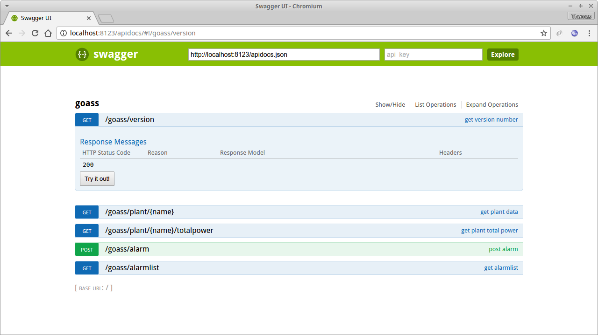

## Task 1: 
  - Fork this github repository, checkout, compile and run *goass* application,
  - Find swagger ui at [http://localhost:8123/apidocs/](http://localhost:8123/apidocs/):
  

## Task 2:
  - implement "getplantpower" calculation of plant's total power
    ([*main.go*, lines 113 ff](main.go#L113) )

## Task 3:
  - document / comment / explain the sample "alarming" implementation in *alarming.go*
  - why is the *channel* and *goroutine* approach used?
  - what would be an alternative / more traditional way?

## Task 4:
  - commit and push to your fork of *goass* and tell us that you're finished

